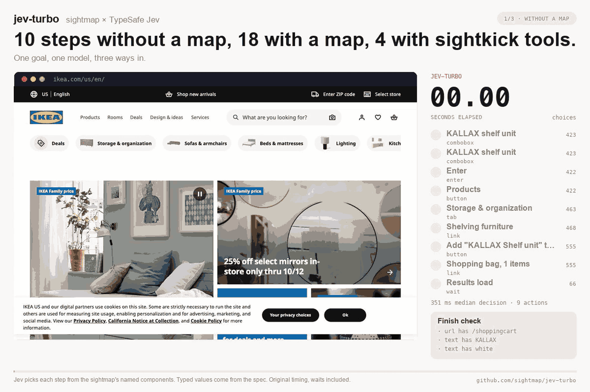

# jev-turbo

**Browser use where a 200 ms model picks every step, measured with and without a map of the site.**

Give it one goal. A [sightmap](https://sightmap.org) turns the page into a short list of named actions. [Jev](https://docs.typesafe.ai/introduction), TypeSafe's typed-answer model, picks one and says whether the goal is met. No large model is called to act. jev-turbo runs that loop with the map and without it, over the same site and the same model, and reports what the map changed.

<a href="docs/demo.mp4"></a>

The white 2x2 KALLAX into the bag on ikea.com, twice with the same model. The listing shows sixteen add buttons that all read `Add "KALLAX Shelf unit" to cart`. Without a map Jev cannot tell them apart, so it goes through the product page in 5 steps with two unsure picks. With the map each button belongs to a ProductCard with a title, so it takes the right one at 1.00, in 4 steps. [MP4](docs/demo.mp4) · [Benchmarks](bench/README.md)

## Quick start

```bash
npm install -g @sightmap/jev-turbo   # installs the sightmap CLI with it
export TYPESAFE_API_KEY=...          # the only key you need
```

Or `go install github.com/sightmap/jev-turbo/cmd/jev-turbo@latest`.

Start a browser session on the site, then give jev-turbo a goal, a finish check, and the values it may type:

```bash
sightmap browser start --detach --url https://www.saucedemo.com/ --sightmap-dir bench/saucedemo/.sightmap
jev-turbo explore --sightmap-dir bench/saucedemo/.sightmap \
  --goal "Log in and put the Sauce Labs Backpack in the cart, then open the cart" \
  --done-when view=Cart --value username=standard_user --value password=secret_sauce
```

```text
 1. Login  filled [UsernameField] with username  [n29:1.00 back:0.00]  done=0.01  321ms (snap 13, pick 149, act 36, settle 122)
 2. Login  filled [PasswordField] with password  [n31:1.00 back:0.00]  done=0.01  297ms (snap 8, pick 136, act 30, settle 122)
 3. Login  clicked [LoginButton]  [n33:1.00 back:0.00]  done=0.01  282ms (snap 7, pick 142, act 10, settle 122)
 4. Inventory  clicked [AddToCartButton label="Add to cart"]  [n91:1.00 back:0.00]  done=0.01  297ms (snap 17, pick 149, act 7, settle 123)
 5. Inventory  clicked [CartLink count="Cart, 1 items"]  [n55:1.00 back:0.00]  done=0.02  335ms (snap 28, pick 181, act 5, settle 121)
 6. Cart  done
OK  done_when satisfied  steps=6  1.5s  picker=jev:jev-latest calls=5 732ms tokens=6120+610
```

No map of the site yet? Point `--sightmap-dir` at an empty directory and add `--grow`: jev-turbo names the controls it meets as it goes, and better names, properties, and notes are still a person's job. `--start` launches the browser session for you; add `--headless` to keep it off your screen.

## What happens in a step

1. The sightmap library reads the page over CDP and matches it against the map. Every visible control becomes a candidate, described by its component name and properties: `[OriginField]`, `[Option label="Zurich Airport (ZRH)"]`.
2. Jev answers two questions in one request: which candidate, and whether the goal is met. It can also pick back, scroll, wait, or Enter.
3. jev-turbo performs the action and waits for the page to settle.

With `--tools DIR`, the tools of a sightkick layer are offered ahead of the page's elements: `log_in(username, password)`, `add_to_cart(name)`. A picked tool runs through `sightkick call`; if no tool fits or a call fails, the step falls back to elements.

Jev never writes text. Everything the loop types comes from `--value` or a spec file. If you would rather have a model write the spec, `--plan` calls Claude once per goal. That is the only large-model call in the tool, and it is optional.

## What the map changed

Same loop, same site, same model, run once with a sightmap and once with `--no-map` so Jev sees the raw HTML and ARIA tree instead. On ikea.com two more conditions appear: `tools`, the map's sightkick tools offered ahead of the elements, and `no memory`, the map with its notes withheld.

| suite | condition | goals reached | steps per reached goal | wasted steps | unsure picks | seconds |
|---|---|---|---|---|---|---|
| saucedemo, 10 goals ×3 | map | 30/30 | 4.5 | 3 | 0 | 48.4 |
| saucedemo, 10 goals ×3 | no map | 30/30 | 4.5 | 3 | 2 | 45.6 |
| journeys, 2 long goals ×3 | map | 3/6 | 13 | 63 | 34 | 53.8 |
| journeys, 2 long goals ×3 | no map | 3/6 | 13 | 53 | 49 | 53.4 |
| Google Flights, Zürich to London ×10 | map | 10/10 | 10 | 7 | 4 | 116.3 |
| Google Flights, Zürich to London ×10 | no map | 10/10 | 15 | 12 | 47 | 143.2 |
| ikea.com, KALLAX into the bag ×5 | map | 5/5 | 4 | 0 | 7 | 69.2 |
| ikea.com, KALLAX into the bag ×5 | no map | 5/5 | 4 | 0 | 5 | 72.8 |
| ikea.com, KALLAX into the bag ×5 | tools | 5/5 | 3 | 0 | 2 | 34.7 |
| ikea.com, 3 exact-variant goals ×5 | map | 15/15 | 5 | 5 | 2 | 198.8 |
| ikea.com, 3 exact-variant goals ×5 | no map | 10/15 | 7 | 34 | 79 | 337.0 |
| ikea.com, 3 exact-variant goals ×5 | no memory | 15/15 | 6 | 7 | 34 | 222.0 |

Unsure picks are picks Jev gave under 60% probability. Wasted steps are a stale click, a back, or a repeat of a control already used on that page.

The map pays where the tree is ambiguous. On saucedemo, whose raw tree already carries good names, it changed little. On Google Flights it cut steps from 15 to 10 and unsure picks from 47 to 4. On ikea.com, any KALLAX into the bag is four steps either way, but the three goals that ask for one exact variant go from 10 of 15 reached to 15 of 15, and from 79 unsure picks to 2, because sixteen add buttons on the listing share one name and only the map ties each to its card. The same map without its notes still reaches every goal but is unsure 34 times: on that site the notes buy confidence rather than steps.

Suites, maps, every run file, the per-goal breakdowns, the score rows, and the Jev-versus-Claude-Sonnet comparison are in [`bench/`](bench/README.md).

## Commands

```
jev-turbo explore --goal "..." [--done-when view=Cart] [--value user=alice] [--avoid Delete] [--plan] [--grow] [--tools DIR] [--record DIR] [--no-map] [--no-memory]
jev-turbo bench   SUITE.json [--repeat N] [--picker jev|anthropic] [--grow] [--tools DIR] [--record DIR] [--no-map] [--no-memory]
jev-turbo score   RESULT.json [RESULT.json ...]   # one column per file
jev-turbo plan    --goal "..." [--site host]
jev-turbo graph   [RUN.json ...]
jev-turbo memory-lint DIR                          # notes that prescribe a route instead of describing the page
```

`--done-when` is a deterministic finish check: `view=NAME`, `url=SUBSTR`, `text=SUBSTR`, `text_absent=SUBSTR`, `text_count=N:SUBSTR` (`N+:` at least, `N-M:` between), `component=NAME`, `prop=Comp.name~value`, or `history_count=N:SUBSTR`. Repeat it to AND checks. Without one, the loop stops when Jev's own "done" answer passes 0.85. A spec file carries the same in JSON:

```json
{ "done_when": { "view": "Cart" }, "values": { "username": "standard_user", "password": "secret_sauce" }, "avoid": ["Delete", "Pay"] }
```

`--avoid` drops matching controls from what Jev can pick. On a real account it is the only guard, so use it.

`--record DIR` captures frames while a goal runs; `scripts/render-demo.py` turns one or more recordings into an MP4 and a GIF like the one above.

## Limits

- Short goals are 2 to 12 steps on cooperative sites; the two long ones cap at 30 and 45 steps, and one fails both with and without the map because the loop cannot repeat a flow.
- Jev picks from what the sightmap library can see: HTML and ARIA controls. Canvas, frames, and file uploads are out.
- Snapshotting a Google Flights page costs 250 to 350 ms a step, and that is most of the gap to a loop tuned for one page.

## Related work

[browser-use/jev-ultrafast](https://github.com/browser-use/jev-ultrafast) runs Jev over a raw element table and has a small LLM write the typed text. Its Google Flights demo is the task in `bench/flights.json`.

## License

MIT. Jev is TypeSafe's model; sightmap is a Fullstory project.
